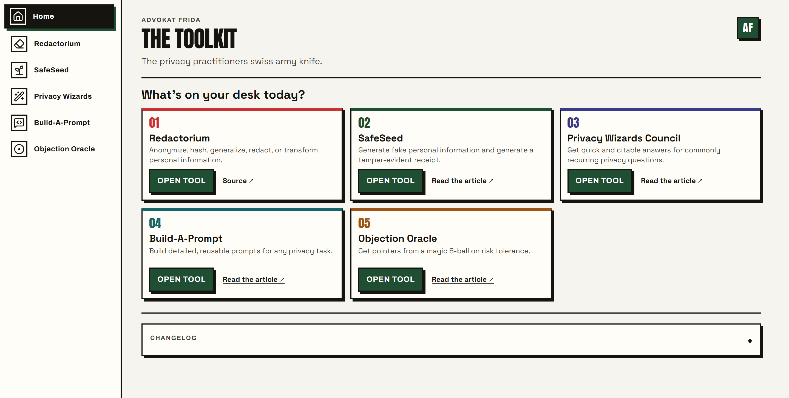

# Advokat Frida Toolkit

The Advokat Frida Toolkit is the private shell application for one navigable privacy-and-AI
workbench. It brings Redactorium, SafeSeed, Privacy Wizards Council, Build-A-Prompt, and Objection
Oracle into one page without throwing away in-progress work when the user switches tools.



## Repository boundary

This repository owns the Home view, navigation, shared visual adapters, local runtime, integration
pipeline, provenance receipts, and Toolkit-specific QA. It is not an umbrella source repository.

Each tool remains owned and developed in its own authoritative repository. Tool behavior, data,
tests, and reusable builds change upstream first. `scripts/sync-tools.mjs` consumes source-owned
build artifacts at recorded revisions and hashes. `public/tools/` is a generated distribution
snapshot that makes this private shell runnable from a fresh clone; do not hand-edit it. A Toolkit
commit records an integration state and never supersedes an upstream tool commit.

| Tool | Authoritative source | Toolkit artifact |
|---|---|---|
| Redactorium | [`tanjaminben/redactorium`](https://github.com/tanjaminben/redactorium) | `public/tools/redactorium/` |
| SafeSeed | [`advokat-frida/safeseed`](https://github.com/advokat-frida/safeseed) | `public/tools/safeseed.html` |
| Privacy Wizards Council | [`advokat-frida/privacy-wizards-council`](https://github.com/advokat-frida/privacy-wizards-council) | `public/tools/privacy-wizards-council.html` |
| Build-A-Prompt | [`advokat-frida/build-a-prompt`](https://github.com/advokat-frida/build-a-prompt) | `public/tools/build-a-prompt.html` |
| Objection Oracle | [`advokat-frida/objection-oracle`](https://github.com/advokat-frida/objection-oracle) | `public/tools/objection-oracle.html` |

The exact source revisions, input hashes, transformed output hashes, and license records live in
[`public/tool-sources.json`](public/tool-sources.json).

## Run locally

Requirements: Node.js 22 or newer.

```powershell
npm.cmd ci
npm.cmd start
```

Open `http://127.0.0.1:4177/`. Starting the app serves the committed snapshot and never runs the
sync pipeline or rewrites tracked files.

## Verify

```powershell
npm.cmd run typecheck
npm.cmd test
npm.cmd run build:web
npm.cmd run qa:visual
```

The visual suite launches its own loopback server, exercises the core flow in all five tools, and
captures the literal desktop, reported desktop, mid-width, mobile, and narrow-mobile states in
`proofs/`. See [`MANIFEST.md`](MANIFEST.md) for the reviewed evidence and current boundary.

## Refresh the integrated artifacts

Synchronization is a maintainer action, not a prerequisite for running the app. Place this repo
beside the six Advokat Frida source repositories, or point `AF_WORKSPACE_ROOT` at that parent:

```powershell
$env:AF_WORKSPACE_ROOT = 'C:\path\to\advokat-frida'
npm.cmd run sync
npm.cmd run qa
```

The sync fails closed when a pinned source artifact changes unexpectedly. Review the upstream diff,
update the expected input hash intentionally, regenerate the snapshot, inspect the rendered states,
and commit the new provenance receipt together.

## Design and release status

The approved product brief and square-shadow visual canon are in [`docs/TOOLKIT-BRIEF.md`](docs/TOOLKIT-BRIEF.md)
and [`docs/TOOLKIT-CANON.md`](docs/TOOLKIT-CANON.md). The current release is private source control
only. It does not deploy the Ghost theme, change the website, publish a tool, configure DNS, add
analytics, or create a public software license.

## Licensing

There is intentionally no blanket license for this repository. Each bundled artifact retains the
upstream terms recorded in `public/licenses/` and `public/tool-sources.json`. Redactorium currently
declares no source license, so this private integration repository makes no public redistribution
grant for that artifact. See [`THIRD-PARTY-NOTICES.md`](THIRD-PARTY-NOTICES.md).
