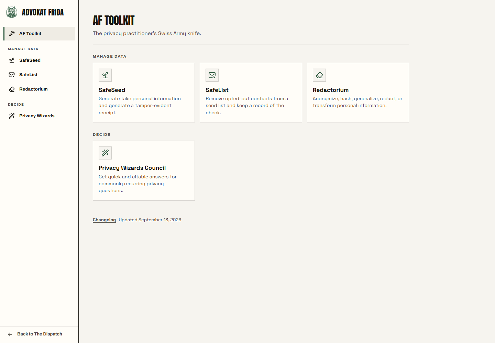

# The Advokat Frida Toolkit

**[toolkit.advokatfrida.com](https://toolkit.advokatfrida.com)**

Five privacy tools that answer the question privacy people get asked all day and rarely have a
good answer to: *okay, but how?*

Use fake data instead of real customer records. Redact that before you send it. Honour the
opt-outs before the campaign goes out. Everyone knows the advice. Almost nobody has been handed
the thing that does it. So the advice gets nodded at and then ignored, and the spreadsheet goes
out anyway.

Every tool here runs entirely in your browser. Your file is never uploaded, because there is
nowhere to upload it to. No account, no server, no analytics. Nothing is fetched from anyone
else's domain while you work: the fonts, the icons and the data are inside the file. Close the tab
and it is gone.



## The tools

| | What it does | Who asks for it |
|---|---|---|
| **SafeSeed** | Generates fake personal data that is fake by construction, with a receipt proving it | Anyone who needs a realistic test dataset and should not be using production |
| **SafeList** | Checks a send list against your opt-outs, one decision per match, with a record | Whoever is about to email a few thousand people on Thursday |
| **Redactorium** | Finds personal data in a file and lets you hash, redact, generalize or swap it | Anyone sharing a spreadsheet, a log, or a PDF outside the team |
| **Privacy Wizards Council** | Sixteen guided determinations that cite their sources at every step | The person who has to answer "does this need a DPIA?" today |
| **Objection Oracle** | Five blunt questions that sort a real blocker from review theatre | Anyone watching a release get held up by a maybe |

Each one is documented in its own folder. Start there if you want the detail.

## Run it yourself

Node 22 or newer.

```bash
npm ci
npm start
```

Then open `http://127.0.0.1:4177/`. That serves the committed snapshot in `public/`; it never
builds anything or touches a tracked file.

You can also just open a tool's built HTML file directly from disk. They are single files by
design, and they work from `file://` with no server at all. That is not a party trick, it is the
point: if a tool needs a server, it can also phone home.

## What is in here

| Path | What it is |
|---|---|
| [`public/`](public/) | The shell people actually use, plus every staged tool artifact. **Generated in part** |
| [`safeseed/`](safeseed/) | Tool source: deterministic synthetic data, as a library, a CLI, and a browser generator |
| [`safelist/`](safelist/) | Tool source: send list checked against the opt-outs |
| [`redactorium/`](redactorium/) | Tool source: file sanitation, React front end |
| [`privacy-wizards-council/`](privacy-wizards-council/) | Tool source: guided determinations, Svelte |
| [`objection-oracle/`](objection-oracle/) | Tool source: release triage, vanilla JS single file |
| [`scripts/`](scripts/) | The gate, and the staging pipeline that puts tools into `public/` |
| [`docs/`](docs/) | How it is built and why: architecture, the design system, the review gate |
| [`proofs/`](proofs/) | Committed screenshots of every screen at every size, reviewed by eye on every change |

## Verify what you were served

The Toolkit's whole claim is that nothing leaves your browser, so you should not have to take our
word for what the browser is running. Every staged artifact is hashed into
[`public/tool-sources.json`](public/tool-sources.json), and the hashes are canonical: the same on
Windows, on Linux, in CI, and at the edge.

```bash
curl -sL https://toolkit.advokatfrida.com/tools/safeseed.html | sha256sum
node -e "console.log(require('./public/tool-sources.json').tools.find(t=>t.id==='safeseed').toolkitSha256)"
```

Those two should match. If they ever do not, something between us and you changed the file, and
we would like to know. [How verification works, in detail](docs/VERIFYING.md).

## Contributing

Read [`CONTRIBUTING.md`](CONTRIBUTING.md). The short version: the design system is not a
suggestion, the gate has to be green, and a new tool has to answer a real "how do I do that?"
rather than merely being a good idea.

## Licence

MIT, in [`LICENSE`](./LICENSE), for all of it. The Advokat Frida name, the fox, and the visual
identity are not covered, for the reasons in [`TRADEMARKS.md`](./TRADEMARKS.md). Third-party
notices are in [`THIRD-PARTY-NOTICES.md`](./THIRD-PARTY-NOTICES.md).

## Who makes this

[Advokat Frida](https://advokatfrida.com) is a privacy and AI governance publication written by
Ben, a working privacy professional, and Frida, who is an AI and does not pretend otherwise.
The Toolkit is the part where we stop writing about the problem and hand you the thing.

None of this is legal advice. It is a set of tools built by people who got tired of saying
"I don't know" when someone asked how.
