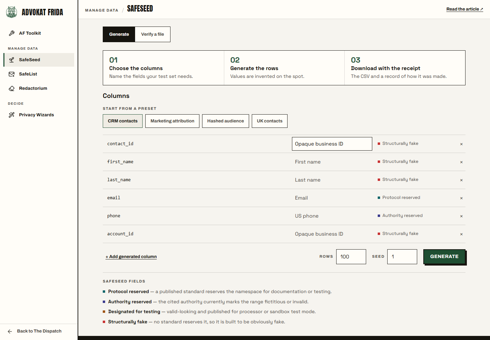
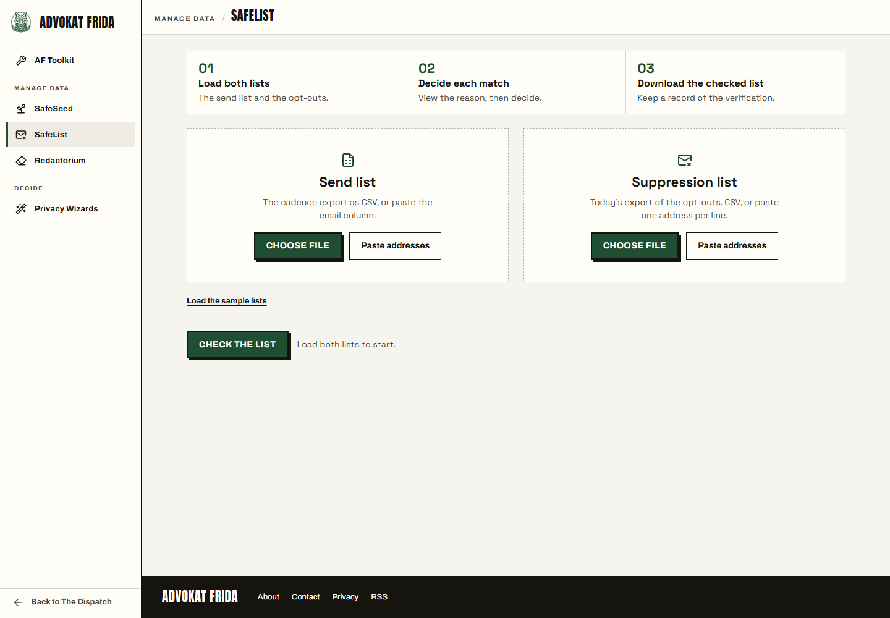
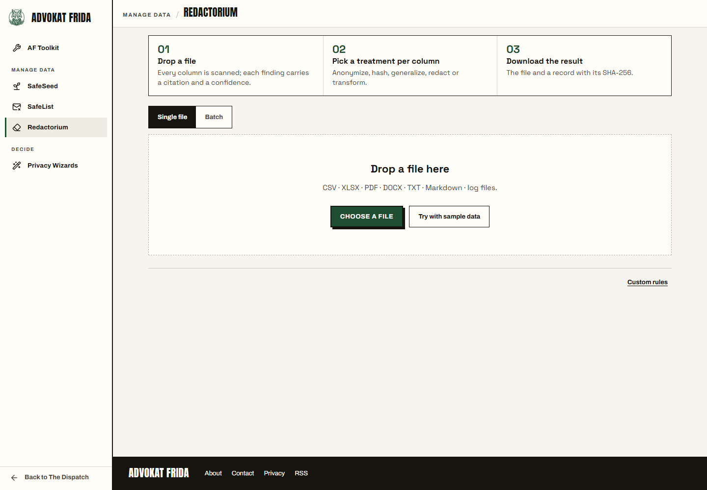
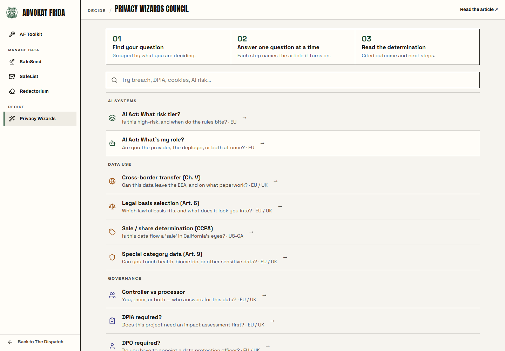

# AF Toolkit

[AF Toolkit](https://toolkit.advokatfrida.com/#home). Lightweight privacy tools for everyday operations. No network calls — your input does not leave your browser.

## A familiar situation

>**Privacy team**: Use fake data. Redact before you send it. Honor opt-outs before the campaign goes out.
>
>**Business**: Okay, but *how?*
>
>**Privacy team**: 🤔

We understand the pain all too well.

Everyone knows the requirements; almost nobody has been handed the thing to do it. We do the same ritual where everyone meets, agrees that privacy is important, and make a decent attempt to resolve it on a Friday afternoon before it comes one with the carpet.

## The tools


| Tool | What it does | Who its for | Preview |
|---|---|---|---|
| **SafeSeed** | Generates fake personal data that is fake by construction, with a receipt proving it | Anyone who needs a realistic test dataset |  |
| **SafeList** | Checks a send list against your opt-outs, one decision per match, with a record | Whoever is about to email a few thousand people on Thursday |  |
| **Redactorium** | Finds personal data in a file and lets you hash, redact, generalize or swap it | Anyone sharing a spreadsheet, a log, or a PDF outside the team |  |
| **Privacy Wizards Council** | Sixteen guided determinations that cite their sources at every step | The person who has to answer "does this need a DPIA?" today |  |

## Run it yourself

Node 22 or newer.

```bash
npm ci
npm start
```

Open `http://127.0.0.1:4177/` which serves the committed snapshot in `public/`.

You can also just open a tool's built HTML file directly from disk. They are single files by design, and they work from `file://` with no server at all.

## Licence

MIT, in [`LICENSE`](./LICENSE), for all of it. The Advokat Frida name, the fox, and the visual identity are not covered, for the reasons in [`TRADEMARKS.md`](./TRADEMARKS.md). Third-party notices are in [`THIRD-PARTY-NOTICES.md`](./THIRD-PARTY-NOTICES.md).
